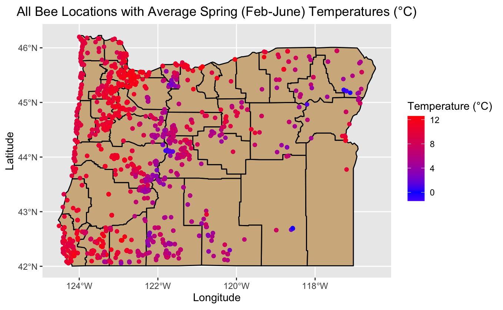
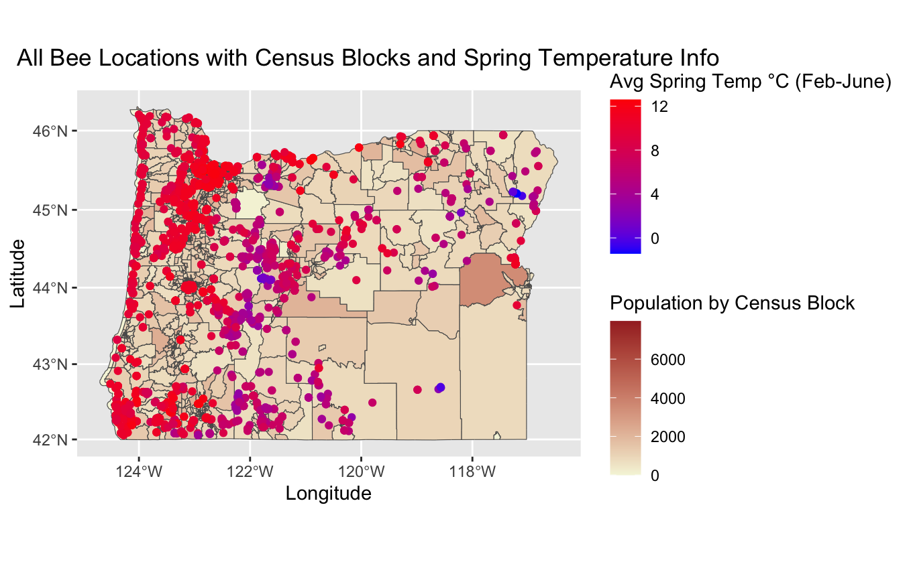
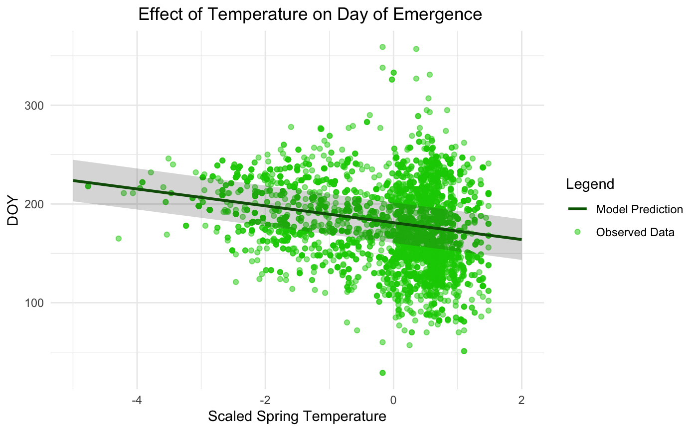
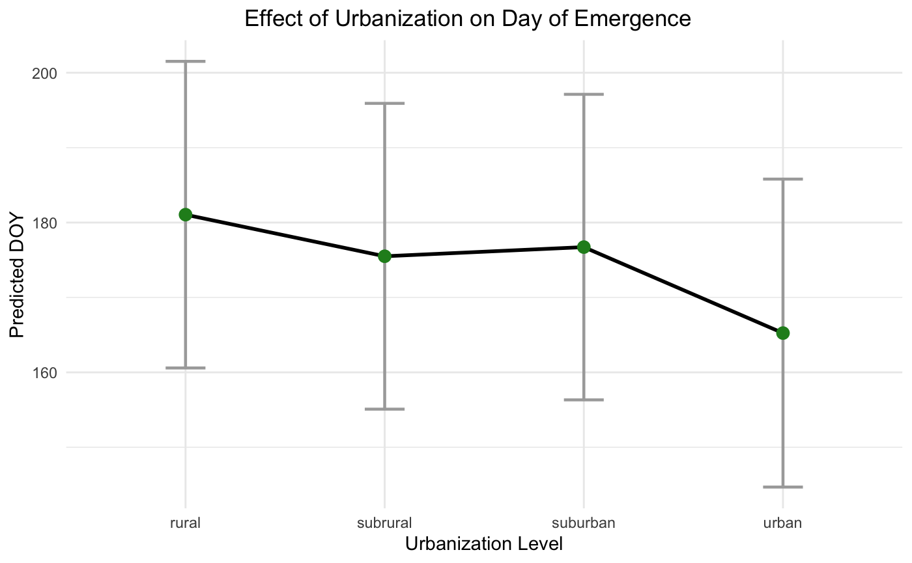
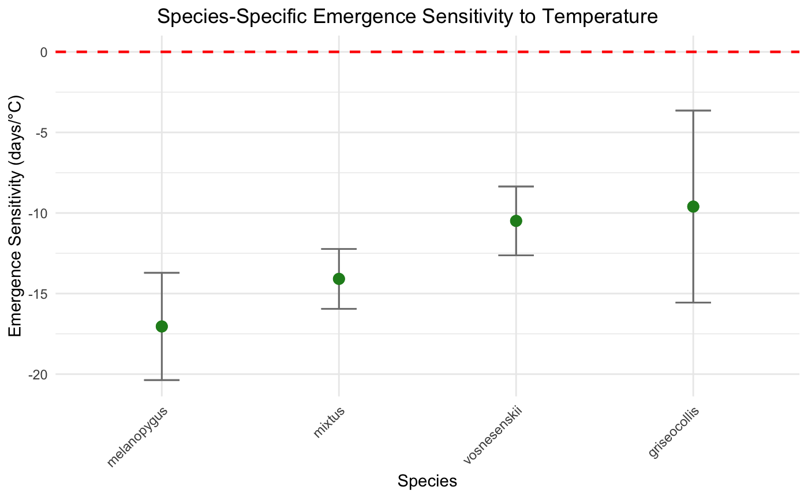

```{r setup, include=FALSE}
knitr::opts_chunk$set(echo = TRUE)
```

Effect of Urbanization and Temperature on Bombus spp. Emergence

Bumble bees (Bombus spp.) and other bee species play an important ecological role as pollinators for various wildflowers and agricultural crops (Ahrné et al. 2009; McCabe et al. 2022). Despite their ecological importance, pollinators face numerous threats from habitat loss, pesticide exposure, climate change, and disease, with many bee populations declining worldwide (Goulson et al. 2008). Habitat loss and fragmentation caused by urbanization emerges as a growing concern due to its rapid expansion and transformation of landscapes that were once natural habitats into fragmented urban environments. Urbanization can have a large effect on Bombus spp. flower visitation rates and pollination success through changes in foraging behavior (Glaum et al. 2017; Harrison & Winfree 2015). Urban heat islands, or the increased temperatures often observed in cities due to concrete and reduced green spaces, further complicate the challenges faced by pollinators (Harrison & Winfree 2015). Together, these pressures can lead to declines in Oregon bee populations, leading to cascading effects impacting the numerous ecosystem services offered. Understanding how urbanization impacts emergence patterns of Bombus spp. is crucial, as these factors are closely tied to their ability to effectively pollinate and maintain stable populations.

Recent research has found that climate change, often resulting from urbanization, is altering phenology, with spring events generally occurring earlier (Stemkovski et al. 2020). For Bombus spp., increased (spring) temperatures have been shown to directly lead to advanced phenology, prompting earlier emergence and activity periods (Prestele et al. 2021). Harrison & Winfree (2015) observed that urban habitats support a greater abundance of late-season bees compared to forest habitats, likely due to the presence of late-blooming plants. They also suggest that urban warming may act as an "ecological filter," reducing species diversity and resulting in a more homogenized bee community in cities. Similarly, Blasi et al. (2023) found that over the past 20 years, a citizen-science dataset has shown that Bombus spp. emergence across Sweden has advanced significantly, though responses varied based on species traits. As in Harrison & Winfree’s findings, warmer temperatures substantially advanced the flight period for early-emerging species, while late-emerging species exhibited no consistent trend. This variability in response among Bombus spp. may contribute to shifts in community composition, favoring species that can better synchronize their life cycles with the altered urban floral availability. Little is known about how these phenological changes impact pollination success across diverse urban ecosystems, especially in areas like Oregon where agricultural productivity and biodiversity heavily depend on stable bee populations.

Understanding these emergence patterns and phenological shifts is crucial for pollinator diversity conservation efforts. Using the Oregon Bee Atlas (OBA), census population block data, and monthly temperature reading from the PRISM group, we are able to develop a more comprehensive analysis of how urbanization and temperature variability affect Bombus spp. Li et al. (2020) demonstrated that human population density can serve as a reliable indicator of urbanization, allowing us to use census data as a proxy for assessing the intensity of urban development and its impacts on bee populations. By combining monthly temperature data and population density, we are able to assess the response of Bombus spp. Across various levels of urbanization, allowing us to identify species-specific emergence patterns and population trends among different bee species.

Our research question is: How does peak emergence for four Bombus species, vosnesenskii, melanopygus, mixtus, and griseocollis, vary along climatic and urbanization gradients? Our first hypothesis is that bees in more heavily urbanized areas will have earlier emergence dates. Our second hypothesis is that areas that have higher mean temperatures will show earlier emergence times. Our third hypothesis is that earlier emerging species will be more sensitive to warming temperature than later emerging species, specifically we will see a more significant change in emergence days per °C of temperature change. 

The data that we be combined is the OBA dataset and merged it with US Census data to get whether those bee observations were in a more rural or urban area. We read in the US Census block data as a shapefile data type. Then we wrangled the population column into 4 even categories using the quantile function. The 4 categories were rural, subrural, urban, and suburban. We then read in the PRISM temperature data, originally as raster data, merging each of the bee observations with temperature, joining on latitude and longitude in order to see what the average temperature is in the area the bee was recorded. With the PRISM temperature data we calculated average spring temperatures, finding the mean of the average temperature from months February-June. For data exploration we made a couple tables filtering the species we were considering focusing on for our analysis, in the Data_Exploration.Rmd file and we took a look at any weird values like NAs in our dataframes using tables in the Data_Cleaning.Rmd file.

To test our hypothesis we used a linear mixed model, and we completed our analysis in the file Bee_Analysis.Rmd. We predicted the day of year of peak emergence for our bee species. We ran the model on all of the species together and on each species separately to see the specific effects of temperature and urbanization on each species. Our formula was: DOY ~ 1 + urbanizationLevel + springTemp + pop + (1 | species). So our fixed effects to predict the day of year were urbanization level, average spring temperature, and population. And our random effect was species to account for variation between species. We ran this model using the “lmer” function. We also used backward selection and the Variance Inflation Factor to make sure that the formula we were using was the most effective at predicting day of year and that we didn’t have any concerning covariance in our model. The output of our model found significance (p < 0.05) in each of our predicting effects, showing that when compared to rural, there was a significant difference in emergence time. Specifically the effect of urbanization resulted in an earlier emergence of about 15.8 days per °C compared to rural areas. Warmer spring temperatures resulted in an earlier emergence day by about 8.5 days per °C. We also found that Bombus spp. that on average have an earlier peak emergence were more sensitive to changes in temperature, going along a gradient where the later peak emergence species were found to be gradually less sensitive to temperature changes.  
















We found that more urbanized areas resulted in an earlier peak emergence, by around 15.8 days per °C. This is likely being caused by the Urban Heat Island Effect which causes warmer microclimates due to less green spaces and a higher concentration of concrete in more urbanized areas. The effect of temperature also causes earlier emergence dates, across all species, by around 8.5 days per °C. This lines up with our understanding of temperature as an environmental cue that regulates phenology, directly or through changes in plant phenological sensitivity.  As for the species-specific phenological sensitivity, Bombus species that have an earlier average peak emergence were more sensitive to the warming changes in temperature, the reliance on temperature could make early-season species more vulnerable to climate change with premature emergence that could cause a mismatch with floral resource availability. 
	
Things that could be causing bias include the fact that urban areas are more populated and easier to access, so there might be an overestimation of the effects of urbanization due to the increased number of observations in urban areas. And there are more common species with more observations, for example Bombus vosnesenskii had 2,692 observations, Bombus mixtus had 545, Bombus melanopygus had 566, and Bombus griseocollis had 306. This means that we could be underestimating the effects on species like griseocollis and underestimating the effects of species like vosnesenskii. (Note: Our figure code can be found in Oregon_Bee_Map.Rmd and BombusModelFigures.Rmd)


References 

Ahrné, K., Bengtsson, J., & Elmqvist, T. (2009). Bumble Bees (Bombus spp) along a Gradient of Increasing Urbanization. PLoS ONE, 4(5), e5574. https://doi.org/10.1371/journal.pone.0005574
McCabe, L. M., Aslan, C. E., & Cobb, N. S. (2022). Decreased bee emergence along an elevation gradient: Implications for climate change revealed by a transplant experiment. Ecology, 103(2), e03598. https://doi.org/10.1002/ecy.3598
Harrison, T., & Winfree, R. (2015). Urban drivers of plant‐pollinator interactions. Functional Ecology, 29(7), 879–888. https://doi.org/10.1111/1365-2435.12486
Glaum, P., Simao, M.-C., Vaidya, C., Fitch, G., & Iulinao, B. (2017). Big city Bombus : using natural history and land-use history to find significant environmental drivers in bumble-bee declines in urban development. Royal Society Open Science, 4(5), 170156. https://doi.org/10.1098/rsos.170156
Goulson, D., Lye, G. C., & Darvill, B. (2008). Decline and Conservation of Bumble Bees. Annual Review of Entomology, 53(1), 191–208. https://doi.org/10.1146/annurev.ento.53.103106.093454
Stemkovski, M., Pearse, W. D., Griffin, S. R., Pardee, G. L., Gibbs, J., Griswold, T., Neff, J. L., Oram, R., Rightmyer, M. G., Sheffield, C. S., Wright, K., Inouye, B. D., Inouye, D. W., & Irwin, R. E. (2020). Bee phenology is predicted by climatic variation and functional traits. Ecology Letters, 23(11), 1589–1598. https://doi.org/10.1111/ele.13583
Blasi, M., Carrié, R., Fägerström, C., Svensson, E., & Persson, A. S. (2023). Historical and citizen-reported data show shifts in bumblebee phenology over the last century in Sweden. Biodiversity and Conservation, 32(5), 1523–1547. https://doi.org/10.1007/s10531-023-02563-5
Prestele, R., Brown, C., Polce, C., Maes, J., & Whitehorn, P. (2021). Large variability in response to projected climate and land‐use changes among European bumblebee species. Global Change Biology, 27(19), 4530–4545. https://doi.org/10.1111/gcb.15780
Li, D., Barve, N., Brenskelle, L., Earl, K., Barve, V., Belitz, M. W., Doby, J., Hantak, M. M., Oswald, J. A., Stucky, B. J., Walters, M., & Guralnick, R. P. (2021). Climate, urbanization, and species traits interactively drive flowering duration. Global Change Biology, 27(4), 892–903. https://doi.org/10.1111/gcb.15461
iNaturalist community. Observations of Bombus spp. from Oregon, recorded between 2017 and 2024. Data exported from https://www.inaturalist.org on December 4, 2024.
